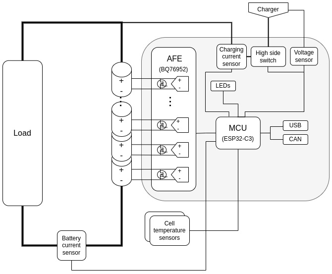

# GreenMobi BMS - A BMS board compatible with the VESC BMS firmware

The [VESC BMS board system is under closed development](https://vesc-project.com/node/311) at the time of this writing although the BMS firmware is publicly available so this project consists on a VESC compatible BMS board that is able to run [VESC BMS firmware](https://github.com/vedderb/vesc_express).

This project is under development and the board is not yet ready. [KiCAD](https://www.kicad.org/) is being used for the board's design and contributions are welcome.

[**Join us on discord**](https://discord.gg/AxKemSxhaV)

## Desing approach

Since there is not yet a opensource design of a VESC fully compatible BMS this board is being designed with ease of development in mind so it can be used as a reference design to contribute directly to the VESC project and extend its potential. So the following principles are followed:

- Popular and easy to source connectors are used (JST PH, screw terminals, etc) even if in most end uses it would be better to have weatherproof panel connectors.
- SMD packages optimized for JLC assembly or PnP on premises (down to 0402 passives).
- Up to 32S supported

Here it is a block diagram of the design:

## Contributions

Since the design is at a schematic phase, it would be helpful if you can review the board's schematic to look for misconnections and erros using any of the given ICs. However, any other kind of productive feedback and work is welcome. Be sure to read the [design approach](#desing-approach) so your contributions match the goals of the project.

### Schematic PDF

To get the latest PDF version of the shematic go to GitHub Actions and download the artifacts of the latest workflow run.

## Credits

This project is meant to be interoperable with the VESC, which is a [registred trademark](https://vesc-project.com/trademark_policies), held by Benjamin Vedder and the BMS firmware and its hardware design hints that are in it that this designs follows are of Benjamin Vedder's authoring.
